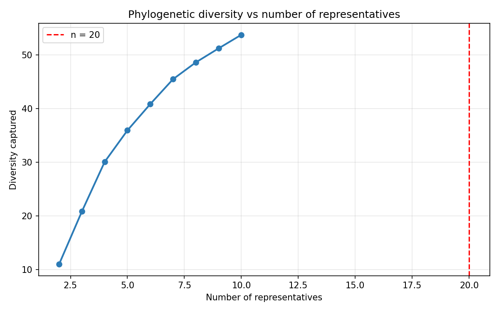
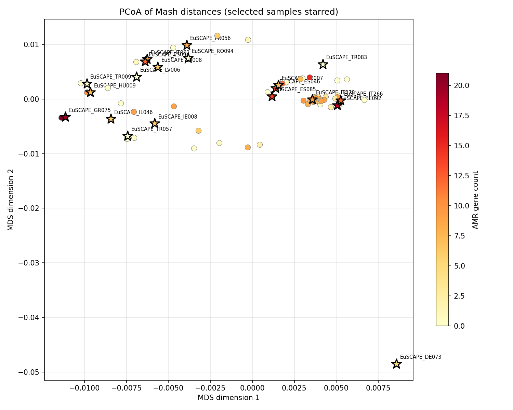
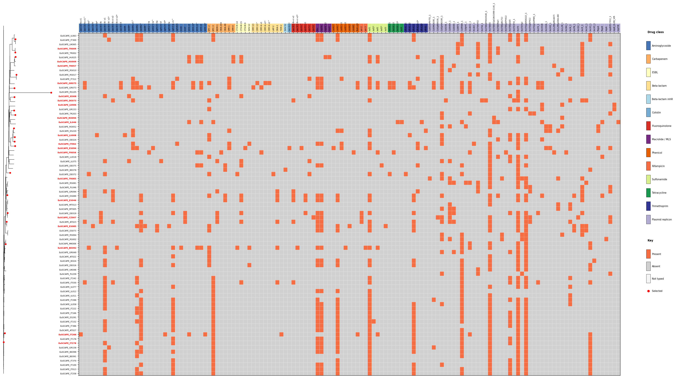
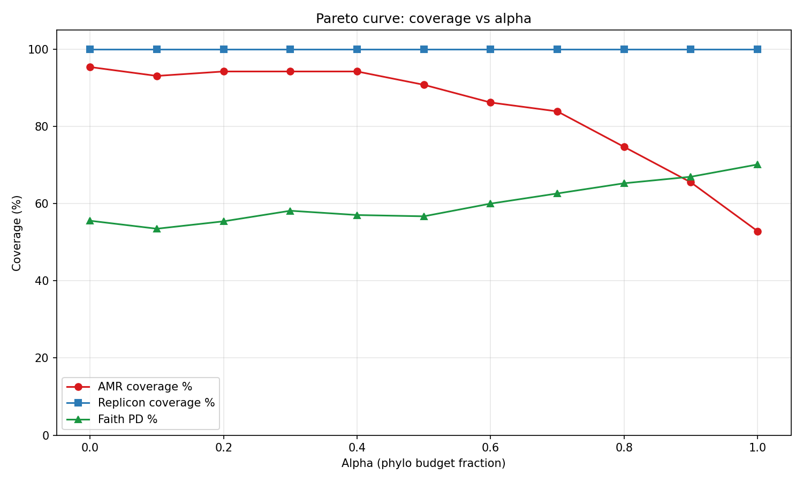

# EuSCAPE Worked Example

This walkthrough demonstrates the full repseq workflow on 79 *Klebsiella pneumoniae* isolates from the **EuSCAPE** (European Survey of Carbapenemase-Producing Enterobacteriaceae) collection — a carbapenem-resistant *K. pneumoniae* surveillance dataset spanning 16 countries.

The goal: select 20 representative isolates for follow-up long-read sequencing, balancing phylogenetic breadth against AMR gene and plasmid replicon diversity.

## Dataset

| Property | Value |
|----------|-------|
| Species | *Klebsiella pneumoniae* complex |
| Isolates | 79 assemblies |
| Countries | Austria, Belgium, Czech Republic, France, Germany, Greece, Hungary, Ireland, Israel, Italy, Latvia, Luxembourg, Romania, Spain, Turkey, UK |
| Dominant STs | ST512 (n=21), ST258 (n=9), ST11 (n=8), ST147 (n=4) |
| AMR gene features (Kleborate) | 87 unique acquired genes |
| Replicon types (ABRicate plasmidfinder) | 48 unique replicon types |

The EuSCAPE collection is a well-characterised surveillance dataset with known epidemiological context, making it ideal for demonstrating repseq. The collection is ST-structured: ST512 and ST258 are closely related NDM/KPC-producing lineages that dominate European carbapenems-resistant *Kpn* surveillance.

## Input files

| File | Description |
|------|-------------|
| `inputs/tree.nwk` | Mash NJ tree built with `mashtree` |
| `inputs/kleborate.tsv` | Kleborate v3 output (AMR gene typing, ST, virulence) |

The tree and Kleborate results were pre-computed and provided as inputs to skip re-running those steps. In practice, repseq runs `mashtree` and Kleborate automatically if you omit `--tree` and `--kleborate`.

## Step 1: Select

```bash
pixi run repseq select \
  --assemblies assemblies/ \
  --tree inputs/tree.nwk \
  --kleborate inputs/kleborate.tsv \
  --n 20 \
  --alpha 0.5 \
  --output-dir select/
```

### How the selection works

repseq splits the budget of 20 slots between two objectives:

**Phylogenetic diversity (10 slots, alpha=0.5):**
PARNAS runs exact k-medoids on the Mash distance tree. It selects the 10 samples that minimise the *minimax distance* — the worst-case gap between any unselected sample and its nearest representative. This is an exact algorithm (not greedy) and guarantees the most uniformly distributed coverage of the tree topology possible for a given budget.

**AMR/replicon diversity (10 slots, greedy set cover):**
The remaining 10 slots are filled by a greedy set cover algorithm on a binary presence/absence matrix of AMR genes and plasmid replicons. The algorithm:

1. Builds a feature matrix: rows = assemblies, columns = AMR genes (from Kleborate) + replicon types (from ABRicate plasmidfinder). Each cell is 1 if that assembly carries that feature, 0 otherwise.
2. Counts which features are already covered by the PARNAS-selected samples.
3. Iteratively picks the assembly that adds the most *new* uncovered features, until the budget is exhausted.

This is the standard greedy set cover heuristic, which is guaranteed to find a solution within (1 − 1/e) ≈ 63% of the optimal coverage — in practice it performs much better because AMR features cluster by lineage.

The combined selection is the union of both sets.

### Selected samples (n=20, alpha=0.5)

| Sample | Slot type | Country |
|--------|-----------|---------|
| EuSCAPE_TR009 | phylo | Turkey |
| EuSCAPE_HU009 | phylo | Hungary |
| EuSCAPE_TR057 | phylo | Turkey |
| EuSCAPE_GR075 | phylo | Greece |
| EuSCAPE_DE073 | phylo | Germany |
| EuSCAPE_LV006 | phylo | Latvia |
| EuSCAPE_RO094 | phylo | Romania |
| EuSCAPE_LU008 | phylo | Luxembourg |
| EuSCAPE_ES046 | phylo | Spain |
| EuSCAPE_IT278 | phylo | Italy |
| EuSCAPE_ES094 | AMR/replicon | Spain |
| EuSCAPE_CZ007 | AMR/replicon | Czech Republic |
| EuSCAPE_BE092 | AMR/replicon | Belgium |
| EuSCAPE_ES085 | AMR/replicon | Spain |
| EuSCAPE_FR056 | AMR/replicon | France |
| EuSCAPE_IL046 | AMR/replicon | Israel |
| EuSCAPE_TR083 | AMR/replicon | Turkey |
| EuSCAPE_IT266 | AMR/replicon | Italy |
| EuSCAPE_IE008 | AMR/replicon | Ireland |
| EuSCAPE_IT062 | AMR/replicon | Italy |

### Coverage summary

```
AMR gene features:
  Total unique: 87
  Covered by selection: 78
  Coverage: 89.7%

Replicon types:
  Total unique: 48
  Covered by selection: 44
  Coverage: 91.7%
```

20 isolates cover 89.7% of AMR gene diversity and 91.7% of replicon diversity in the collection.

### Figures

**Elbow plot** — phylogenetic diversity vs n, used to choose n:



The elbow is at approximately n=10–12, where adding more samples yields diminishing returns on Faith's Phylogenetic Diversity. At n=20, we capture about 70% of the total PD if all slots were phylogenetic.

**PCoA scatter** — Mash distance PCoA with selected samples starred:



The selected samples are distributed across the PCoA space. The tight ST512/ST258 cluster (bottom-right) is represented by a small number of samples, consistent with PARNAS minimising redundancy within clades.

**Tree + AMR heatmap** — selected samples shown in red, AMR/replicon features as coloured columns:



The heatmap shows the binary AMR presence/absence matrix alongside the phylogenetic tree. Selected samples (red labels) span both the phylogenetically distinct branches and the samples with the most distinctive AMR/replicon profiles.

## Step 2: Evaluate

```bash
pixi run repseq evaluate \
  --selected select/selected.txt \
  --ground-truth inputs/kleborate.tsv \
  --tree inputs/tree.nwk \
  --output-dir evaluate/
```

| Metric | Value | Random baseline |
|--------|-------|----------------|
| Faith PD (%) | **57.8%** | 31.1% |
| AMR gene coverage (%) | **89.7%** | 60.7% |
| ST coverage (%) | **55.6%** (10/18 STs) | — |
| Minimax distance (max) | 0.0112 | — |
| Minimax distance (mean) | 0.0029 | — |

repseq's selection covers **57.8% of Faith's Phylogenetic Diversity** compared to a random baseline of **31.1%** — a 1.9× improvement. AMR coverage is **89.7%** vs a random baseline of **60.7%** — a 1.5× improvement. The selection captures **10 of the 18 sequence types** (55.6%) present in the collection, including all major lineages (ST512, ST258, ST11, ST147).

**Faith's Phylogenetic Diversity:** the total branch length of the minimum spanning subtree of the selected samples as a fraction of the total tree branch length. A value of 57.8% means the 20 selected samples span 57.8% of the evolutionary history of the 79-isolate collection.

**Minimax distance:** for each unselected sample, the distance to its nearest selected neighbour. The max minimax distance (0.0112) is the worst-case gap — the most isolated unselected sample. The mean (0.0029) describes typical coverage quality. PARNAS directly minimises the max minimax distance; this is therefore the most appropriate metric for assessing the phylogenetic component of the selection.

**Why the random baseline matters:** A reviewer will always ask "how much better than random?" The random baseline here uses 100 draws of 20 random samples from the same pool, computing the mean Faith PD % and AMR coverage % for each. This confirms the selection is not just a lucky draw.

## Step 3: Sweep

```bash
pixi run repseq sweep \
  --assemblies assemblies/ \
  --tree inputs/tree.nwk \
  --kleborate inputs/kleborate.tsv \
  --n 20 \
  --ground-truth inputs/kleborate.tsv \
  --output-dir sweep/
```

The sweep runs `select` + `evaluate` at alpha = 0.0, 0.1, …, 1.0 and plots the Pareto trade-off between phylogenetic diversity and AMR coverage.

**Pareto curve:**



| alpha | Faith PD (%) | AMR coverage (%) | vs random PD | vs random AMR |
|-------|-------------|-----------------|-------------|--------------|
| 0.0 | 55.6% | 95.4% | +24pp | +37pp |
| 0.2 | 55.4% | 94.3% | +25pp | +35pp |
| 0.4 | 57.1% | 94.3% | +26pp | +33pp |
| **0.5** | **56.7%** | **90.8%** | **+24pp** | **+30pp** |
| 0.6 | 60.0% | 86.2% | +29pp | +25pp |
| 0.7 | 62.6% | 83.9% | +33pp | +24pp |
| 0.8 | 65.3% | 74.7% | +32pp | +15pp |
| 1.0 | 70.2% | 52.9% | +38pp | −7pp |

Key observations:

1. **All alphas 0.0–0.9 beat random on both axes.** At alpha=1.0, AMR coverage (52.9%) falls below the random baseline AMR mean (~59%), meaning pure phylogenetic selection under-samples AMR diversity.

2. **The elbow is around alpha=0.6–0.7.** Faith PD jumps from ~55% (alpha 0.0–0.5) to 60–63% as phylo budget increases, but AMR coverage drops steeply. The marginal gain in PD per unit of AMR loss accelerates after alpha=0.6.

3. **Recommended alpha for this collection: 0.6.** At alpha=0.6 you get 60.0% Faith PD and 86.2% AMR coverage — a good balance that beats random comfortably on both axes.

4. **If AMR/plasmid context is the primary goal** (e.g., profiling the horizontal gene transfer landscape), use alpha=0.0–0.3: 94–95% AMR coverage with ~55% Faith PD, well above the random phylo baseline of ~32%.

See `sweep/pareto_note.txt` for further guidance.

## Choosing alpha for your collection

This is a scientific decision, not a statistical one. The Pareto curve shows the trade-off; you must decide based on your study goals:

| Goal | Suggested alpha |
|------|----------------|
| Characterise AMR gene / plasmid ecology | 0.0 – 0.3 |
| Balanced default | **0.5** |
| Phylogenetic breadth + AMR context | 0.6 – 0.7 |
| Outbreak reconstruction / phylogenetic surveillance | 0.8 – 1.0 |

Always verify that your chosen alpha beats the random baseline on both axes using `repseq evaluate`.

## Notes on this dataset

- **Kleborate replicon columns:** This Kleborate run does not include a `plasmid_replicons` column (that column appears only when Kleborate's full kpsc module detects plasmid-associated loci). Replicon diversity is therefore assessed entirely from ABRicate plasmidfinder output. The `pct_replicons_covered` and `total_replicon_types` columns in `evaluate/coverage_metrics.tsv` show 0/0 because `repseq evaluate` currently reads replicons from the Kleborate ground-truth file, which has none. The replicon coverage numbers in `select/coverage_summary.txt` (91.7% of 48 types) are correct and come from the ABRicate output produced during the select step.

- **EuSCAPE assembly quality:** Assemblies are short-read Illumina assemblies. The Mash distance tree approximates the true SNP phylogeny; for publication, validate topology against a core-genome SNP tree.
