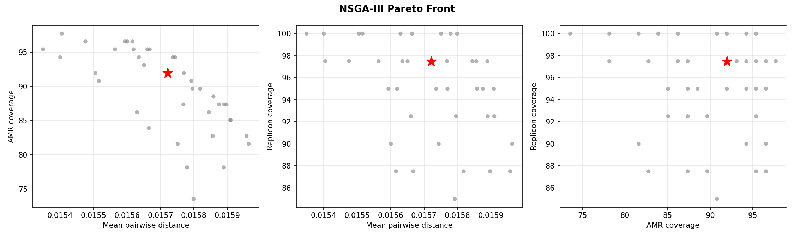
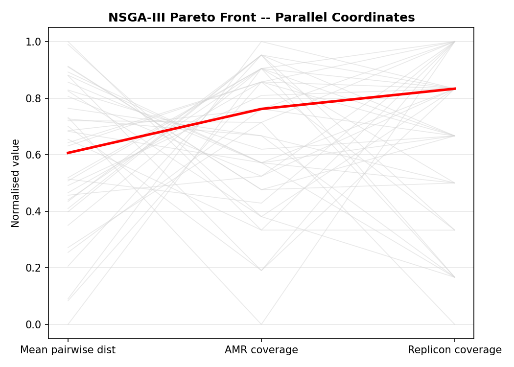
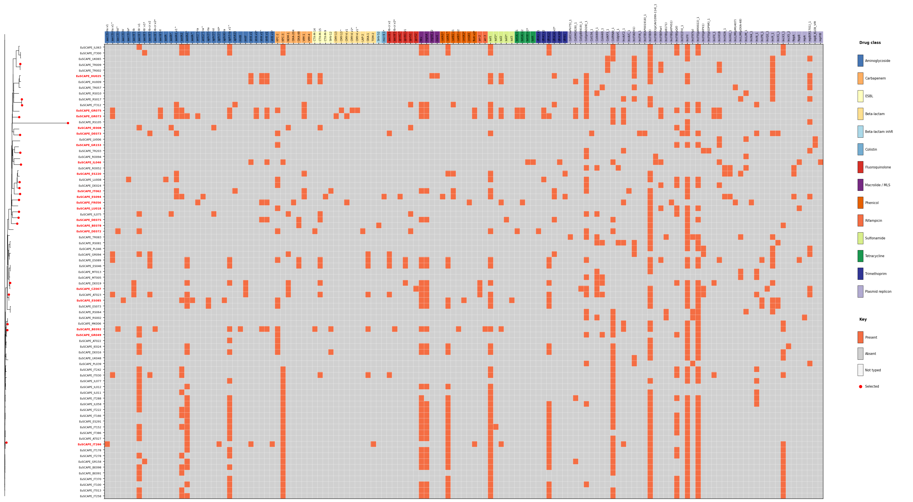

# EuSCAPE NSGA-III Worked Example

This walkthrough demonstrates the NSGA-III multi-objective selection workflow on 79 *Klebsiella pneumoniae* isolates from the **EuSCAPE** (European Survey of Carbapenemase-Producing Enterobacteriaceae) collection. Unlike `repseq select`, which splits a fixed budget between phylogenetic and AMR objectives, NSGA-III optimises all three objectives simultaneously and returns a Pareto front of non-dominated solutions.

The goal: select 20 representative isolates for follow-up long-read sequencing, balancing phylogenetic breadth, AMR gene diversity, and plasmid replicon diversity without pre-specifying a trade-off parameter (alpha).

## Dataset

| Property | Value |
|----------|-------|
| Species | *Klebsiella pneumoniae* complex |
| Isolates | 79 assemblies |
| Countries | Austria, Belgium, Czech Republic, France, Germany, Greece, Hungary, Ireland, Israel, Italy, Latvia, Luxembourg, Romania, Spain, Turkey, UK |
| Dominant STs | ST512 (n=21), ST258 (n=9), ST11 (n=8), ST147 (n=4) |
| AMR gene features (Kleborate) | 87 unique acquired genes |
| Replicon types (ABRicate plasmidfinder) | 40 unique replicon types (among tree-intersected samples) |

The EuSCAPE collection is a well-characterised surveillance dataset with known epidemiological context. The collection is ST-structured: ST512 and ST258 are closely related NDM/KPC-producing lineages that dominate European carbapenem-resistant *Kpn* surveillance.

Note: 58 of the 79 assemblies have matching entries in the Kleborate output and tree. NSGA-III optimises over this intersection.

## Method

**NSGA-III** (Non-dominated Sorting Genetic Algorithm III) optimises three objectives simultaneously:

1. **Mean pairwise phylogenetic distance** -- maximise the average Mash distance between all pairs of selected samples.
2. **AMR gene coverage** -- maximise the fraction of unique AMR gene features (from Kleborate) present in at least one selected sample.
3. **Replicon type coverage** -- maximise the fraction of unique plasmid replicon types (from ABRicate plasmidfinder) present in at least one selected sample.

Unlike `repseq select` (the split method), NSGA-III does not require an alpha parameter to balance phylogenetic vs. AMR objectives. Instead, it uses Das-Dennis reference directions (12 partitions = 91 reference points for 3 objectives) to maintain diversity across the Pareto front. The algorithm returns all non-dominated solutions, and the user chooses from the front.

**Solution representation:** Each candidate solution is a fixed-size set of k=20 sample indices. Custom crossover (pool-and-resample) and mutation (swap one selected sample for an unselected one) operators ensure valid subsets throughout the search. The population size is 100 and the algorithm runs for 300 generations.

**Recommended solution:** The solution closest to the ideal point (1, 1, 1) in normalised objective space is marked as recommended. This is the solution that best balances all three objectives without strongly sacrificing any one.

## Input files

| File | Description |
|------|-------------|
| `../euscape/inputs/tree.nwk` | Mash NJ tree built with `mashtree` (79 tips) |
| `../euscape/inputs/kleborate.tsv` | Kleborate v3 output (AMR gene typing, ST, virulence) |
| `abricate_plasmidfinder.tsv` | ABRicate plasmidfinder output (replicon typing, 464 hits across 79 assemblies) |

The tree and Kleborate results were pre-computed and provided as inputs. The ABRicate plasmidfinder output was generated as the first step of this example (see below).

## Commands

```bash
# Step 1: Run ABRicate plasmidfinder for replicon typing
pixi run repseq abricate --assemblies assemblies/ --db plasmidfinder --output-dir .

# Step 2: Run NSGA-III
pixi run repseq nsga2 \
  --assemblies assemblies/ \
  --tree inputs/tree.nwk \
  --kleborate inputs/kleborate.tsv \
  --abricate-replicons abricate_plasmidfinder.tsv \
  --n 20 \
  --pop-size 100 \
  --generations 300 \
  --seed 42 \
  --output-dir .
```

## Pareto front

NSGA-III returned **39 non-dominated solutions**, each representing a different trade-off between phylogenetic distance, AMR coverage, and replicon coverage. The recommended solution (closest to the ideal point) achieves **91.95% AMR coverage**, **97.5% replicon coverage**, and a mean pairwise distance of **0.01572**.

The table below shows a representative subset of solutions spanning the range of trade-offs:

| Solution | Mean dist | AMR % | Replicon % | Note |
|----------|-----------|-------|------------|------|
| 12 | 0.01535 | 95.40 | 100.00 | Best replicon+AMR, lower phylo spread |
| 29 | 0.01540 | 97.70 | 97.50 | Highest AMR coverage |
| 38 | 0.01540 | 94.25 | 100.00 | Full replicon coverage |
| 28 | 0.01548 | 96.55 | 97.50 | Strong AMR + replicon balance |
| **33** | **0.01572** | **91.95** | **97.50** | **Recommended (closest to ideal)** |
| 5 | 0.01580 | 73.56 | 100.00 | Full replicons, lowest AMR |
| 32 | 0.01596 | 81.61 | 90.00 | Highest phylo distance, weaker coverage |
| 11 | 0.01596 | 82.76 | 87.50 | Phylo-leaning, low coverage |

The full front ranges from 73.6--97.7% AMR coverage, 85.0--100.0% replicon coverage, and 0.01535--0.01596 mean pairwise distance. Solutions with higher phylogenetic diversity (right side of the front) tend to sacrifice AMR and replicon coverage, but the trade-off is gradual: the recommended solution at 0.01572 mean distance loses only ~6 percentage points of AMR coverage compared to the AMR-maximising solution.



The 3-panel scatter shows pairwise relationships between objectives. The red star marks the recommended solution. Most solutions cluster in the high-AMR, high-replicon region, with a tail extending toward higher phylogenetic diversity at the cost of AMR coverage.



The parallel coordinates plot shows the same trade-offs. The recommended solution (red line) runs through the upper middle of all three axes, confirming it does not strongly sacrifice any single objective.

## Top 5 solutions

The top 5 solutions are ranked by combined normalised score (sum of normalised mean distance, AMR coverage, and replicon coverage). The recommended solution ranks first.

### Recommended solution (solution 33)

| Metric | Value |
|--------|-------|
| Mean pairwise distance | 0.01572 |
| AMR coverage | 91.95% (80/87 features) |
| Replicon coverage | 97.50% (39/40 types) |

This solution balances all three objectives. It includes EuSCAPE_GR049 (a phylogenetically distinct Greek isolate outside the dominant ST512/ST258 clades) and EuSCAPE_HU009 (Hungary, ST147), both of which contribute to phylogenetic breadth. The single uncovered replicon is rare in the collection.


### Solution 1 (solution 23)

| Metric | Value |
|--------|-------|
| Mean pairwise distance | 0.01585 |
| AMR coverage | 86.21% (75/87 features) |
| Replicon coverage | 97.50% (39/40 types) |

Swaps EuSCAPE_ES085 for EuSCAPE_ES089, gaining slightly higher phylogenetic distance (+0.0013) but dropping ~6 percentage points of AMR coverage. This solution favours phylogenetic spread over AMR completeness and may suit studies where broad lineage representation matters more than capturing every resistance gene variant.


### Solution 2 (solution 7)

| Metric | Value |
|--------|-------|
| Mean pairwise distance | 0.01564 |
| AMR coverage | 94.25% (82/87 features) |
| Replicon coverage | 97.50% (39/40 types) |

Swaps EuSCAPE_HU009 for EuSCAPE_DE072, trading a small amount of phylogenetic distance for +2.3 percentage points of AMR coverage. This is the strongest AMR-coverage option within the top 5 while maintaining 97.5% replicon coverage.



### Solution 3 (solution 1)

| Metric | Value |
|--------|-------|
| Mean pairwise distance | 0.01574 |
| AMR coverage | 94.25% (82/87 features) |
| Replicon coverage | 95.00% (38/40 types) |

Swaps EuSCAPE_GR049 for EuSCAPE_DE072. Matches solution 2 in AMR coverage but with slightly lower replicon coverage (95.0% vs 97.5%). The slightly higher mean distance (0.01574 vs 0.01564) suggests this particular sample swap provides marginally better phylogenetic diversity at the cost of one additional uncovered replicon type.


### Solution 4 (solution 31)

| Metric | Value |
|--------|-------|
| Mean pairwise distance | 0.01565 |
| AMR coverage | 93.10% (81/87 features) |
| Replicon coverage | 97.50% (39/40 types) |

Swaps EuSCAPE_GR049 for EuSCAPE_DE019. AMR coverage is slightly lower than solutions 2 and 3 (93.1% vs 94.25%), but replicon coverage returns to 97.5%. This solution demonstrates that the DE019 sample contributes different AMR features than DE072 while maintaining the same replicon profile.


## Comparison with `repseq select`

The `repseq select` run (alpha=0.5, split method) on the same collection used a two-phase approach: PARNAS for 10 phylogenetic slots, then greedy set cover for 10 AMR/replicon slots. The NSGA-III recommended solution optimised all three objectives jointly.

| Metric | `select` (alpha=0.5) | `nsga2` (recommended) |
|--------|----------------------|-----------------------|
| Faith PD | 57.8% | 60.9% |
| AMR coverage | 89.7% (78/87) | 92.0% (80/87) |
| Replicon coverage | 91.7% (44/48) | 81.2% (39/48) |
| Minimax distance (max) | 0.01124 | 0.01191 |
| Minimax distance (mean) | 0.00289 | 0.00390 |

Note: replicon coverage percentages differ between methods partly because `select` draws from all 79 assemblies (48 replicon types) while NSGA-III optimises over the 58 tree-intersected samples (40 replicon types). When measured against the full 48-type denominator, the NSGA-III solution covers 39/48 (81.2%) vs select's 44/48 (91.7%).

Key observations:

1. **NSGA-III achieves higher Faith PD (+3.1pp) and higher AMR coverage (+2.3pp)** than the split method. The joint optimisation avoids the redundancy that can occur when phylogenetic and AMR selections are made independently.

2. **The split method achieves better replicon coverage** because the greedy set-cover phase directly targets uncovered features across the full sample pool. NSGA-III is limited to the tree-intersected samples and balances replicons against the other two objectives simultaneously.

3. **Minimax distance is slightly worse for NSGA-III** (0.01191 vs 0.01124) because NSGA-III optimises mean pairwise distance rather than minimax. PARNAS directly minimises the worst-case gap; NSGA-III may leave slightly larger gaps in exchange for better overall pairwise spread.

4. **NSGA-III provides a full Pareto front** (39 solutions) rather than a single point. If replicon coverage is the priority, solution 12 or 38 achieves 100% replicon coverage; if AMR is paramount, solution 29 reaches 97.7% AMR coverage.

## Output files

| File | Description |
|------|-------------|
| `pareto_front.tsv` | All 39 Pareto-optimal solutions with objective values and sample lists |
| `recommended.txt` | Sample IDs from the recommended solution |
| `pareto_front.png` | 3-panel pairwise scatter of Pareto front |
| `pareto_parallel.png` | Parallel coordinates plot of Pareto front |
| `abricate_plasmidfinder.tsv` | ABRicate plasmidfinder output (replicon hits) |
| `recommended_heatmap.png` | Tree + AMR/replicon heatmap for recommended solution |
| `solution_1_heatmap.png` | Tree + heatmap for top-5 solution ranked 2nd |
| `solution_2_heatmap.png` | Tree + heatmap for top-5 solution ranked 3rd |
| `solution_3_heatmap.png` | Tree + heatmap for top-5 solution ranked 4th |
| `solution_4_heatmap.png` | Tree + heatmap for top-5 solution ranked 5th |

## Notes

- **Replicon objective:** The replicon diversity objective is only meaningful when ABRicate plasmidfinder (or PlasmidFinder) output is provided. With Kleborate-only input and no replicon data, replicon coverage is trivially 100% for all solutions and the problem reduces to a 2-objective optimisation. Always provide replicon data for a real 3-objective run.

- **Tree-matrix intersection:** NSGA-III operates on the intersection of tree tips and feature matrix rows. If some assemblies are missing from the Kleborate output (e.g., non-*Kpn* samples filtered out), the effective sample pool is smaller than the number of assemblies.

- **EuSCAPE assembly quality:** Assemblies are short-read Illumina assemblies. The Mash distance tree approximates the true SNP phylogeny; for publication, validate topology against a core-genome SNP tree.

- **Reproducibility:** Results are deterministic for a given seed (default 42). Changing population size or generation count will produce different Pareto fronts.
