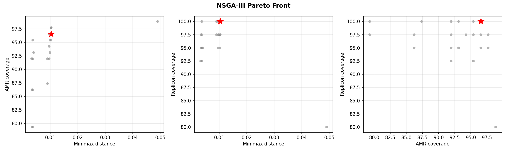
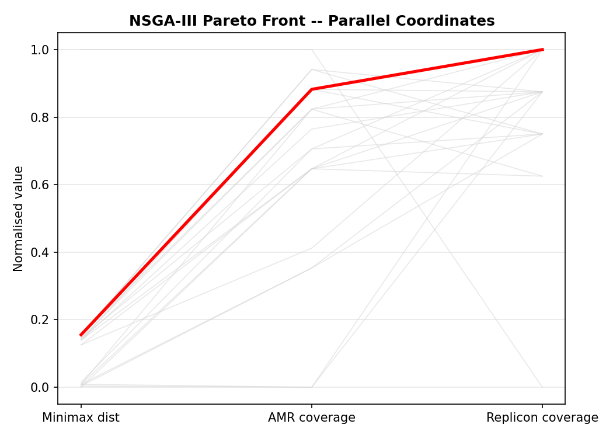
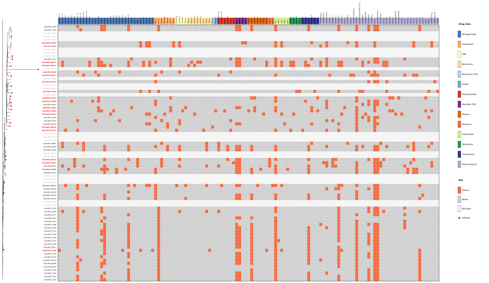
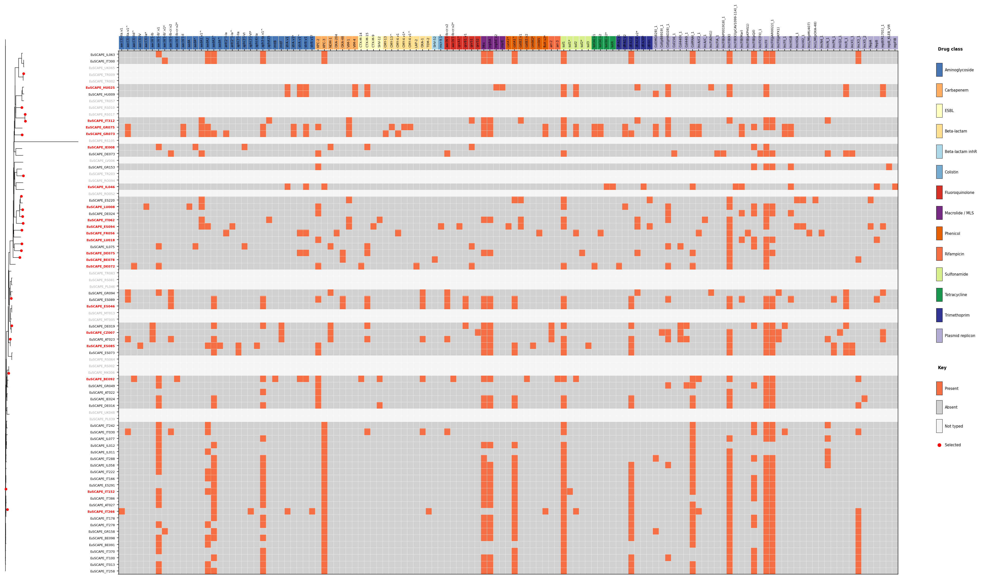

# EuSCAPE NSGA-III Worked Example

This walkthrough demonstrates the NSGA-III multi-objective selection workflow on 79 *Klebsiella pneumoniae* isolates from the **EuSCAPE** (European Survey of Carbapenemase-Producing Enterobacteriaceae) collection. Unlike `repseq select`, which splits a fixed budget between phylogenetic and AMR objectives, NSGA-III optimises all three objectives simultaneously and returns a Pareto front of non-dominated solutions.

The goal: select 20 representative isolates for follow-up long-read sequencing, balancing phylogenetic breadth, AMR gene diversity, and plasmid replicon diversity without pre-specifying a trade-off parameter (alpha).

## Dataset

| Property | Value |
|----------|-------|
| Species | *Klebsiella pneumoniae* complex |
| Isolates | 79 assemblies |
| Countries | Austria, Belgium, Czech Republic, France, Germany, Greece, Hungary, Ireland, Israel, Italy, Latvia, Luxembourg, Romania, Spain, Turkey, UK |
| Dominant STs | ST512 (n=21), ST258 (n=9), ST11 (n=8), ST147 (n=4) |
| AMR gene features (Kleborate) | 87 unique acquired genes |
| Replicon types (ABRicate plasmidfinder) | 40 unique replicon types (among tree-intersected samples) |

The EuSCAPE collection is a well-characterised surveillance dataset with known epidemiological context. The collection is ST-structured: ST512 and ST258 are closely related NDM/KPC-producing lineages that dominate European carbapenem-resistant *Kpn* surveillance.

Note: 58 of the 79 assemblies have matching entries in the Kleborate output and tree. NSGA-III optimises over this intersection.

## Method

**NSGA-III** (Non-dominated Sorting Genetic Algorithm III) optimises three objectives simultaneously:

1. **Minimax phylogenetic distance** -- minimise the worst-case gap between any unselected sample and its nearest selected sample. This is the same criterion used by PARNAS: the minimax distance measures how well the selected set covers the full phylogeny, with lower values meaning no sample is far from a representative. Unlike mean pairwise distance, minimax directly penalises large gaps in coverage.
2. **AMR gene coverage** -- maximise the fraction of unique AMR gene features (from Kleborate) present in at least one selected sample.
3. **Replicon type coverage** -- maximise the fraction of unique plasmid replicon types (from ABRicate plasmidfinder) present in at least one selected sample.

Unlike `repseq select` (the split method), NSGA-III does not require an alpha parameter to balance phylogenetic vs. AMR objectives. Instead, it uses Das-Dennis reference directions (12 partitions = 91 reference points for 3 objectives) to maintain diversity across the Pareto front. The algorithm returns all non-dominated solutions, and the user chooses from the front.

**Solution representation:** Each candidate solution is a fixed-size set of k=20 sample indices. Custom crossover (pool-and-resample) and mutation (swap one selected sample for an unselected one) operators ensure valid subsets throughout the search. The population size is 100 and the algorithm runs for 300 generations.

**Recommended solution:** The solution closest to the ideal point in normalised objective space, where minimax distance is inverted (lower = better) and AMR/replicon coverages are normalised to [0, 1]. This is the solution that best balances all three objectives without strongly sacrificing any one.

## Input files

| File | Description |
|------|-------------|
| `../euscape/inputs/tree.nwk` | Mash NJ tree built with `mashtree` (79 tips) |
| `../euscape/inputs/kleborate.tsv` | Kleborate v3 output (AMR gene typing, ST, virulence) |
| `abricate_plasmidfinder.tsv` | ABRicate plasmidfinder output (replicon typing, 464 hits across 79 assemblies) |

The tree and Kleborate results were pre-computed and provided as inputs. The ABRicate plasmidfinder output was generated as the first step of this example (see below).

## Commands

```bash
# Step 1: Run ABRicate plasmidfinder for replicon typing
pixi run repseq abricate --assemblies assemblies/ --db plasmidfinder --output-dir .

# Step 2: Run NSGA-III
pixi run repseq nsga3 \
  --assemblies assemblies/ \
  --tree inputs/tree.nwk \
  --kleborate inputs/kleborate.tsv \
  --abricate-replicons abricate_plasmidfinder.tsv \
  --n 20 \
  --pop-size 100 \
  --generations 300 \
  --seed 42 \
  --output-dir .
```

## Pareto front

NSGA-III returned **21 non-dominated solutions**, each representing a different trade-off between minimax distance, AMR coverage, and replicon coverage. The recommended solution (closest to the ideal point) achieves **96.55% AMR coverage**, **100.0% replicon coverage**, and a minimax distance of **0.01037**.

The table below shows a representative subset of solutions spanning the range of trade-offs:

| Solution | Minimax dist | AMR % | Replicon % | Note |
|----------|-------------|-------|------------|------|
| 0 | 0.00326 | 91.95 | 92.50 | Lowest minimax (best phylo coverage) |
| 2 | 0.04902 | 98.85 | 80.00 | Highest AMR coverage |
| 6 | 0.00365 | 79.31 | 100.00 | Full replicon coverage, lower AMR |
| **16** | **0.01037** | **96.55** | **100.00** | **Recommended (closest to ideal)** |
| 3 | 0.01037 | 97.70 | 97.50 | Strong AMR, slightly lower replicons |
| 12 | 0.01030 | 95.40 | 100.00 | Full replicon, good AMR balance |
| 18 | 0.00900 | 87.36 | 100.00 | Gap filler -- moderate on all axes |

The full front ranges from 79.3--98.9% AMR coverage, 80.0--100.0% replicon coverage, and 0.00326--0.04902 minimax distance. Solutions with lower minimax distance (better phylogenetic coverage) tend to sacrifice AMR coverage, but the trade-off is gradual: the recommended solution at 0.01037 minimax distance achieves 96.55% AMR coverage while maintaining full replicon coverage.



The 3-panel scatter shows pairwise relationships between objectives. The red star marks the recommended solution. Most solutions cluster in the low-minimax, high-replicon region, with outliers trading phylogenetic coverage for higher AMR diversity.



The parallel coordinates plot shows the same trade-offs. The recommended solution (red line) runs through the upper middle of all three axes, confirming it does not strongly sacrifice any single objective.

## Anchor solutions

Five solutions are selected as anchor points across the Pareto front, each representing an extreme or balanced trade-off. These are chosen deterministically: best on each individual objective, the recommended balanced solution, and a gap-filler that maximises diversity from the other four in normalised objective space.

### Recommended (balanced) -- solution 16

| Metric | Value |
|--------|-------|
| Minimax distance | 0.01037 |
| AMR coverage | 96.55% |
| Replicon coverage | 100.00% |

The recommended solution balances all three objectives. It achieves full replicon coverage while maintaining strong AMR coverage (96.55%) and reasonable phylogenetic coverage. This is the best starting point when no single objective dominates the study design.



### Best AMR -- solution 2

| Metric | Value |
|--------|-------|
| Minimax distance | 0.04902 |
| AMR coverage | 98.85% |
| Replicon coverage | 80.00% |

This solution maximises AMR gene coverage at the cost of both phylogenetic and replicon diversity. The high minimax distance (0.049) means some unselected samples are poorly represented by the selection, and replicon coverage drops to 80%. Suitable when capturing rare resistance determinants is the primary goal.



### Best replicon -- solution 6

| Metric | Value |
|--------|-------|
| Minimax distance | 0.00365 |
| AMR coverage | 79.31% |
| Replicon coverage | 100.00% |

This solution achieves full replicon coverage with excellent phylogenetic coverage (minimax 0.0037), but AMR coverage drops to 79.3%. It prioritises plasmid diversity and phylogenetic representativeness over AMR gene capture.


### Best phylo -- solution 0

| Metric | Value |
|--------|-------|
| Minimax distance | 0.00326 |
| AMR coverage | 91.95% |
| Replicon coverage | 92.50% |

The lowest minimax distance means every unselected sample is close to at least one selected representative. AMR and replicon coverage are both above 90%, making this a strong choice when phylogenetic representativeness is the priority.


### Gap filler -- solution 18

| Metric | Value |
|--------|-------|
| Minimax distance | 0.00900 |
| AMR coverage | 87.36% |
| Replicon coverage | 100.00% |

Selected as the solution most distant from the other four anchors in normalised objective space. It occupies a moderate position on all three axes, filling a gap in the displayed trade-off landscape that the extremes and the recommended solution leave uncovered.


## Output files

| File | Description |
|------|-------------|
| `pareto_front.tsv` | All 21 Pareto-optimal solutions with objective values and sample lists |
| `recommended.txt` | Sample IDs from the recommended solution |
| `pareto_front.png` | 3-panel pairwise scatter of Pareto front |
| `pareto_parallel.png` | Parallel coordinates plot of Pareto front |
| `abricate_plasmidfinder.tsv` | ABRicate plasmidfinder output (replicon hits) |
| `recommended_heatmap.png` | Tree + AMR/replicon heatmap for recommended solution |
| `solution_amr_heatmap.png` | Tree + heatmap for best AMR solution |
| `solution_rep_heatmap.png` | Tree + heatmap for best replicon solution |
| `solution_phylo_heatmap.png` | Tree + heatmap for best phylo solution |
| `solution_balanced_heatmap.png` | Tree + heatmap for gap-filler solution |

## Notes

- **Replicon objective:** The replicon diversity objective is only meaningful when ABRicate plasmidfinder (or PlasmidFinder) output is provided. With Kleborate-only input and no replicon data, replicon coverage is trivially 100% for all solutions and the problem reduces to a 2-objective optimisation. Always provide replicon data for a real 3-objective run.

- **Tree-matrix intersection:** NSGA-III operates on the intersection of tree tips and feature matrix rows. If some assemblies are missing from the Kleborate output (e.g., non-*Kpn* samples filtered out), the effective sample pool is smaller than the number of assemblies.

- **EuSCAPE assembly quality:** Assemblies are short-read Illumina assemblies. The Mash distance tree approximates the true SNP phylogeny; for publication, validate topology against a core-genome SNP tree.

- **Reproducibility:** Results are deterministic for a given seed (default 42). Changing population size or generation count will produce different Pareto fronts.
